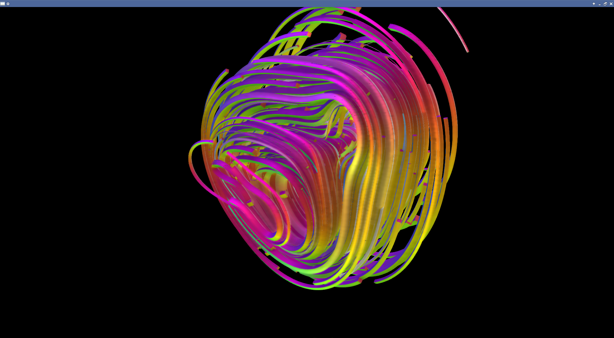
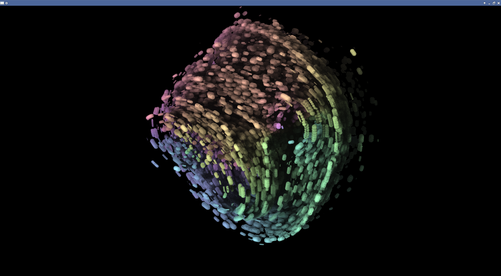
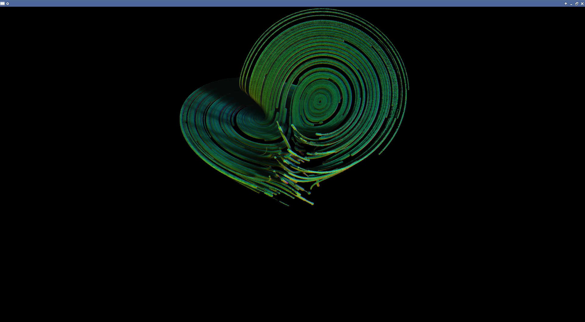

##Smalld's particle system

This is my pet project which serves the sole purpose of learning new versions of OpenGL (currently 4.4), how to do programming on gpus and exploring capabilities of the concept of particle system itself (for example learn how to do a physics simulation in various ways, or explore a concept of an IFS or a dynamic system)

Code consists of some OO wrappers over the pure OpenGL, which is imported by means of the OpenTK library. Wrappers serve the purpose of defining a more declarative approach for the overall setup, and it works fine for me. Implemented functions are:
- manipulation with shaders, readout of shaders from the assembly resources and/or from files with observation of changes
- setup of uniforms, uniforms can be set dynamically and/or bound to properties of a class (with some minor effort)
- setup of vertex attributes, textures and framebuffers
- setup of several rendering phases into one big shading setup
- .. and more may come

Particle systems are and should be written from scratch (I didn't put any effort to develop a general framework). The biggest effort has been put into System3, which is somehow extensible and there are a few things you can play with and into System4, which is actually for doing experiments with implicit surfaces.

##Screenshots

##Further plans
I have some plans to play more, and there are few things I have come across and which gained my attention:

* (http://www.fractalforums.com/3d-fractal-generation/true-3d-mandlebrot-type-fractal/#lastPost)
* something like (http://rrrola.wz.cz/downloads.html#effects)
* (http://klein.math.okstate.edu/IndrasPearls/)
* system could be based on weird knots construction, introduced in (http://www.josleys.com/articles/ams_article/Lorenz3.htm)
* random walks
* recursive rendering, instead of single projection use "something" like picture stored geometry
* something like organic structure resembling the veins. Reuse sphere sprites and do some depth smoothing.
* L-systems, 
* see prusinkiewicz's site (http://algorithmicbotany.org/)
* (http://www.digitalpoiesis.org/index.html)
* Reconstruction of zero-level sets from particles

